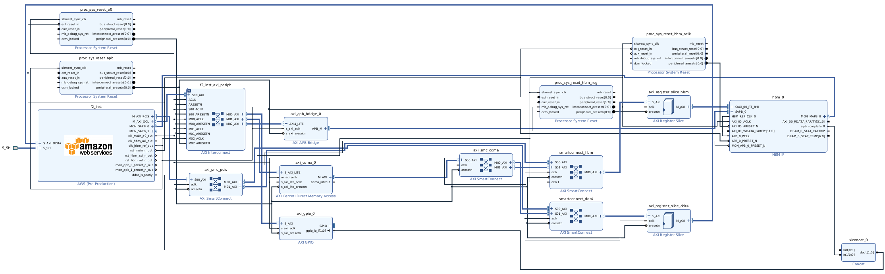

HLx Flow for CDMA Test IP Integrator Example
============================================

Table of Contents
-----------------

- `HLx Flow for CDMA Test IP Integrator
  Example <#hlx-flow-for-cdma-test-ip-integrator-example>`__

  - `Table of Contents <#table-of-contents>`__
  - `Overview <#overview>`__
  - `Building and Testing Example <#building-and-testing-example>`__

Overview
--------

This example design exercises the following data interfaces:

- AXIL_OCL: Polls the AXI GPIO to which the DDR and HBM calibration done
  signals are connected
- AXI_PCIS: Writes 1K data pattern to DDR source buffer
- AXIL_OCL: Configures AXI CDMA for 1K DMA transfer from DDR to HBM and polls
  AXI CDMA status register to determine transfer completion
- AXI_PCIS: Reads 1K from HBM destination buffer and compares against
  original data pattern

|block-diagram|

Building and Testing Example
----------------------------

Follow the common design steps specified in the `IPI example design flow
document <./../../../docs/IPI-GUI-Flows.html>`__ to build and test this
example on F2 instances.

