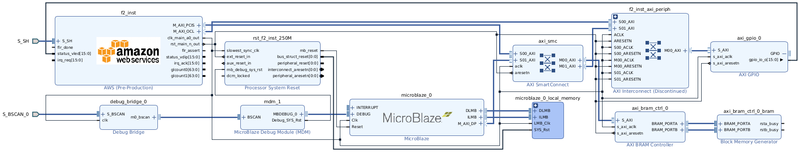

HLx Flow for Hello World MicroBlaze IP Integrator Example
=========================================================

Table of Contents
-----------------

  - `Overview <#mb-hlx-overview>`__
  - `Building and Testing Example <#mb-hlx-building-and-testing-example>`__

    - `MicroBlaze Debug Module (MCM) <#mb-hlx-microblaze-debug-module-mcm>`__
    - `BRAM Access through VJTAG and MDM <#mb-hlx-bram-access-through-vjtag-and-mdm>`__

.. _mb-hlx-overview:

Overview
--------

This design shares the same basic structure as the
`hello_world example <./../hello-world-hlx/README.html>`__.

In addition, the design includes a MicroBlaze (MB) processor with LMB memory
connections and a MicroBlaze Debug Module (MDM) for debugging purposes.
The MicroBlaze uses its Data Port (DP) Master to access the AXI BRAM,
which is also accessible by the PCIS Master. Through BSCAN, the host's XSDB
program connects to the MDM, allowing it to issue commands to the MicroBlaze
for reading and writing to the AXI BRAM.

The example program executes in the following sequence:

- After reset, MicroBlaze (MB) begins executing from an ELF file that is loaded
  into LMB Memory.
- MicroBlaze writes into the shared memory and writes into bit 0 of the
  GPIO. MicroBlaze polls for bit 1 and bit 0 to be asserted.
- The host polls GPIO bit 0 for assertion. It writes a pattern into
  the shared memory (``0xBEEF_DEAD``) and writes into bit 1 of the
  GPIO.
- Once MicroBlaze polls GPIO bit 1 and bit 0 assertion, it verifies the
  write pattern (``0xBEEF_DEAD``) from the host and writes to GPIO bit
  2.
- The polls GPIO bit2, bit1 and bit0 assertion. After that, the application
  competes successfully.

|block-diagram-mb-hlx|

.. _mb-hlx-building-and-testing-example:

Building and Testing Example
----------------------------

Follow the common design steps specified in the `IPI example design flow
document <./../../../docs/IPI-GUI-Flows.html>`__ to build and test this
example on F2 instances.

.. _mb-hlx-microblaze-debug-module-mcm:

MicroBlaze Debug Module (MCM)
~~~~~~~~~~~~~~~~~~~~~~~~~~~~~

- Before design implementation, Enable the BSCAN ports in CL by defining
  the ``BSCAN_EN`` macro. **NOTE: This is required to use the MicroBlaze
  Debug Module (MDM) in the design.**

  .. code:: text

     set_property verilog_define BSCAN_EN=1 [current_fileset]

.. _mb-hlx-bram-access-through-vjtag-and-mdm:

.. code:: text

  BRAM Access through VJTAG and MDM
     xsdb% connect
     tcfchan#0
     xsdb% targets
       1  debug_bridge
          2  00000000
          3  00000000
          4  MicroBlaze Debug Module at USER1.2.2
             5  MicroBlaze #0 (Running)
     xsdb% target 5                    # <------- Change the target to MicroBlaze
     xsdb% mwr 0xC0000100 0xDEADBEEF   # <------- Test a memory write to the BRAM's start address
     xsdb% mrd 0xC0000100              # <------- Read to verify the test data has been stored in the BRAM successfully
     C0000100:   DEADBEEF

