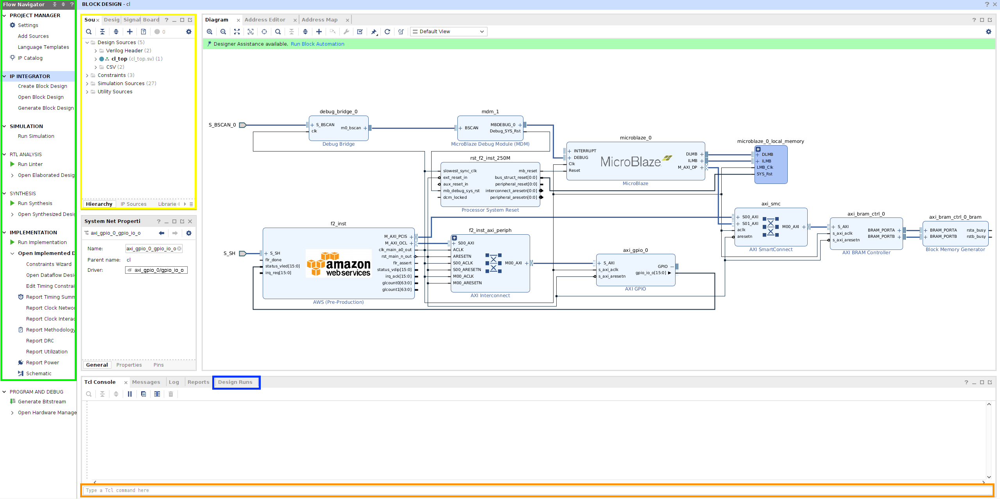
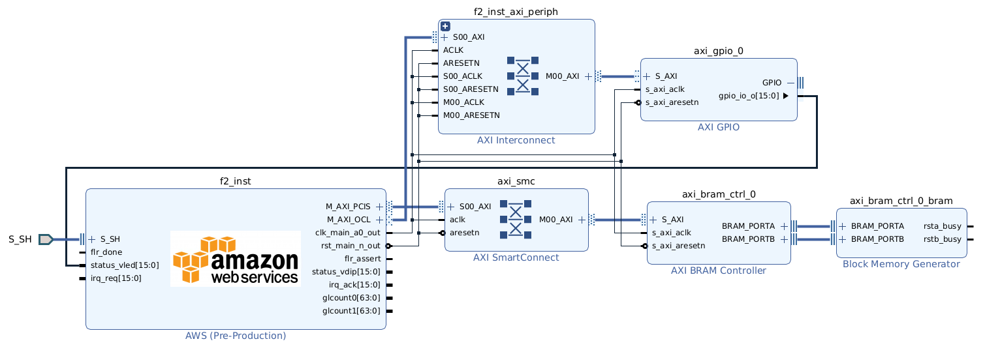

Vivado IP Integrator Setup
==========================

Table of Contents
-----------------

- `Vivado IP Integrator Setup <#vivado-ip-integrator-setup>`__

  - `Table of Contents <#table-of-contents>`__
  - `Overview <#overview>`__
  - `Installation in Linux <#installation-in-linux>`__

    - `Switching between HDK and HLx
      flows <#switching-between-hdk-and-hlx-flows>`__

  - `Vivado Overview <#vivado-overview>`__

    - `Sources Tab <#sources-tab>`__

      - `Hierarchy Tab <#hierarchy-tab>`__
      - `IP Sources Tab <#ip-sources-tab>`__

    - `Flow Navigator <#flow-navigator>`__

      - `PROJECT MANAGER <#project-manager>`__
      - `IP INTEGRATOR <#ip-integrator>`__
      - `SIMULATION <#simulation>`__
      - `RTL ANALYSIS <#rtl-analysis>`__
      - `SYNTHESIS <#synthesis>`__
      - `IMPLEMENTATION <#implementation>`__

    - `TCL Commands <#tcl-commands>`__
    - `Design Runs Tab <#design-runs-tab>`__

  - `Vivado Flows Overview <#vivado-flows-overview>`__

    - `IP Integration flow <#ip-integration-flow>`__
    - `General Environment <#general-environment>`__

      - `Design Constraints in
        Project <#design-constraints-in-project>`__
      - `Synthesis/Implementation <#synthesis-implementation>`__

  - `Next Steps <#next-steps>`__

Overview
--------

This document assumes you have cloned the developer kit and sourced the
`hdk_setup.sh <https://github.com/aws/aws-fpga/tree/f2/hdk_setup.sh>`__. It is highly
recommended that you get familiar with the HDK development flow by
following the `step-by-step quick start guide for customer hardware
development <../README.html>`__ prior to using the Vivado IP
Integrator (IPI).

After you become familiar with building an example AFI and running it on
F2 instances, refer to `IP Integrator Quick Start
Examples <./IPI-GUI-Examples.html>`__ documentation for help with example
designs, new designs, and additional tutorials.

Installation in Linux
---------------------

Using a text editor, open either ``~/.Xilinx/Vivado/init.tcl`` or
``~/.Xilinx/Vivado/Vivado_init.tcl``. If neither files exists, run the
following command to create one under ``~/.Xilinx/Vivado/``.

.. code:: bash

   touch Vivado_init.tcl

To get the absolute path of ``$HDK_SHELL_DIR`` , use this command:

.. code:: bash

   echo $HDK_SHELL_DIR

**NOTE**: If your ``$HDK_SHELL_DIR`` is empty or does not display when
echoed, you need to source the
`hdk_setup.sh <https://github.com/aws/aws-fpga/tree/f2/hdk_setup.sh>`__.

In ``init.tcl`` or ``Vivado_init.tcl``, append the following lines based
upon the ``$HDK_SHELL_DIR`` path to the end of the file.

.. code:: bash

   set shell small_shell
   source $::env(HDK_SHELL_DIR)/hlx/hlx_setup.tcl

**NOTE**: A ``shell`` variable must be specified for the flow to pair
the customer design with the correct shell variant. Valid values are
``xdma_shell`` (coming soon) or ``small_shell``.

Switching between HDK and HLx flows
~~~~~~~~~~~~~~~~~~~~~~~~~~~~~~~~~~~

- Vivado automatically sources either ``~/.Xilinx/Vivado/init.tcl`` or
  ``~/.Xilinx/Vivado/Vivado_init.tcl`` at startup. After completing the
  setup steps above, the IPI features will load automatically each time
  you launch Vivado.

- To switch back to the HDK flow, please remove the
  ``source $::env(HDK_SHELL_DIR)/hlx/hlx_setup.tcl`` line from your
  ``init.tcl`` or ``Vivado_init.tcl`` file.

Vivado Overview
---------------

This section provides a basic overview of the Vivado GUI. The GUI
environment enables developers of all experience levels to:

- Quickly set project options and strategies to meet design requirements
- Access interactive reports and design views
- Efficiently resolve timing and area issues

The IP Integrator (IPI) is a design entry tool in the Vivado HLx Design
Suite. It allows developers to connect IPs at a block level and
generates 'what you see is what you get' RTL files in either VHDL or
Verilog format. The IPI flow enhances the standard RTL flow by providing
designer assistance features, including:

- Simplified connectivity of IPs through interface-based connections
- Block automation that adds helper IPs (such as interconnects, DMAs,
  and other support blocks) based on IP configuration
- Connectivity automation for routing interfaces, clocks, and resets
  between blocks
- Design Rule Checks (DRCs) for ensuring proper interface connectivity
  and clock domain crossing
- Advanced hardware debug capabilities enabling transaction-level
  debugging

For detailed information and design methodology guidelines, refer to the
following documentation:

- `Vivado Design Suite User Guide
  (UG892) <https://docs.amd.com/r/en-US/ug892-vivado-design-flows-overview>`__
- `Designing IP Sybsystems UsingIP Integrator
  (UG994) <https://docs.amd.com/r/en-US/ug994-vivado-ip-subsystems>`__
- `UltraFast Design Methodology Guide for FPGAs and SoCs
  (UG949) <https://docs.amd.com/r/en-US/ug949-vivado-design-methodology>`__

To open the GUI, run command ``vivado``. After Vivado loads, create an
empty project by selecting ``Create New Project`` and following the
prompts until you see a blank canvas. The sections below describe the
tabs and menus, refer to the screenshot below. Exploring these tabs and
menus in your blank project is encouraged.

|vivado_gui|

Sources Tab
~~~~~~~~~~~

The box in yellow contains the design sources.

Hierarchy Tab
^^^^^^^^^^^^^

The 'Sources' tab is divided into three different categories.

1. Design Sources: contains synthesis/implementation sources
2. Constraints: contains timing constraint (XDC) files
3. Simulation Sources: contains simulation-only sources

Clicking on a file displays its information in the 'Properties' tab
(under 'Sources'). In this tab, you can specify how the file is used in
the design flow:

- RTL/IP sources are typically marked for:

  - Synthesis, implementation, simulation
  - Synthesis, implementation
  - Simulation

- XDC files are typically marked for:

  - Synthesis, implementation
  - Synthesis
  - Implementation

IP Sources Tab
^^^^^^^^^^^^^^

When an IP is added to your project, the 'IP Sources' tab becomes
visible. This tab contains imported IP sources.

Flow Navigator
~~~~~~~~~~~~~~

The 'Flow Navigator', located in the green box, allows you to launch
predefined design flow steps, such as synthesis and implementation.

PROJECT MANAGER
^^^^^^^^^^^^^^^

The 'PROJECT MANAGER' section allows you to add sources (RTL, IP, and
XDC files), access Language Templates for common RTL constructs, XDCs
and DEBUG, and use IP Catalog to add IPs to the project. This portion
targets the RTL flow.

The IP Catalog allows you to search for specific IPs or browse through
IP categories. When using IP Catalog, you are responsible for adding and
connecting the IP to your RTL design.

IP INTEGRATOR
^^^^^^^^^^^^^

This section allows you to open and modify the 'Block Design' and
generate the 'Block Design' after validation.

**Note**: The HLx flow pre-creates the 'Block Design' framework with AWS
IP and board, so 'Create Block Design' is not necessary.

Double-clicking an IP in the 'Block Design' opens the 'Re-customize IP'
dialog box, where you can review or modify IP settings. When connecting
designs, you can use 'Run Connection Automation' to automatically
connect interfaces.

SIMULATION
^^^^^^^^^^

In this section, you can modify simulation settings by right-clicking
'SIMULATION'. To run a simulation, select 'Run Simulation' → 'Run
Behavioral Simulation'.

RTL ANALYSIS
^^^^^^^^^^^^

Clicking 'Open Elaborate Design' analyzes the RTL files, allowing you to
verify RTL structures and syntax before synthesis.

SYNTHESIS
^^^^^^^^^

Right-clicking 'SYNTHESIS' allows you to view synthesis settings and
launch a synthesis run. After synthesis completes, click 'Open
Synthesized Design' to access the post-synthesis checkpoint for
analysis. This stage is crucial for developing timing constraints for
the CL.

IMPLEMENTATION
^^^^^^^^^^^^^^

Right-clicking 'IMPLEMENTATION' allows you to view implementation
settings and launch an implementation run. After implementation
completes, click 'Open Implemented Design' to access the
post-implementation checkpoint for analysis of the SH (Shell) and CL
(Custom Logic).

TCL Commands
~~~~~~~~~~~~

The orange box is where you enter Tcl commands. The 'Tcl Console' tab
above displays the command outputs.

Design Runs Tab
~~~~~~~~~~~~~~~

The 'Design Runs' are located in the blue box. This area provides
functionality similar to the 'SYNTHESIS' and 'IMPLEMENTATION' sections
in the 'Flow Navigator'. The examples and tutorials demonstrate how to
use 'synth_1' and 'impl_1' runs to build your design.

Vivado Flows Overview
---------------------

The Vivado HLx environment supports IP Integrator (IPI) flow. This
section provides a top-level overview of these flows. For detailed
information, see `HLx GUI Flows with Vivado IP
Integrator <./IPI-GUI-Flows.html>`__.

IP Integration flow
~~~~~~~~~~~~~~~~~~~

You can easily create a full design by adding Vivado IP to the block
diagram. Use RTL module referencing to add custom RTL as IP to the block
diagram. This flow supports both RTL and IP additions as IP blocks. Find
examples in the `IP Integrator Quick Start
Examples <./IPI-GUI-Examples.html#hlx-examples-using-ip-integrator-flow>`__.

|ipi_mod_ref|

General Environment
~~~~~~~~~~~~~~~~~~~

Design Constraints in Project
^^^^^^^^^^^^^^^^^^^^^^^^^^^^^

Top-level clocks from the Shell are provided for synthesis in:

- cl_clocks_aws.xdc – Top-level clock constraints for the CL

The following files are available for adding custom constraints:

- cl_synth_user.xdc – User synthesis constraints
- cl_pnr_user.xdc – User timing and floorplanning constraints

Synthesis/Implementation
^^^^^^^^^^^^^^^^^^^^^^^^

By default, synthesis is using the ``Default`` directive and all
implementation steps are using the ``Explore`` directive.

To modify implementation settings, right-click 'IMPLEMENTATION', click
'Implementation Settings...' and selection the 'Implementation' option
in 'Project Settings'. Modify directives only for

- opt_design
- place_design
- phys_opt_design
- route_design

NOTE: Do not change the ``Strategy`` option, as this will override HLx
environment settings.

For getting started, refer to `IP Integrator Quick Start
Examples <./IPI-GUI-Examples.html>`__.

Next Steps
----------

1. Review the `AWS IP <./IPI-GUI-AWS-IP.html>`__ documentation to
   familiarize yourself with shell features available in the IPI
   environment.
2. Test `building an IPI example design in Vivado
   GUI <./IPI-GUI-Flows.html>`__
3. Proceed to the `IPI Quick Start Examples <./IPI-GUI-Examples.html>`__
   for guidance on creating example designs, developing new designs and
   following additional tutorials.

`Back to Home <./../../index.html>`__
